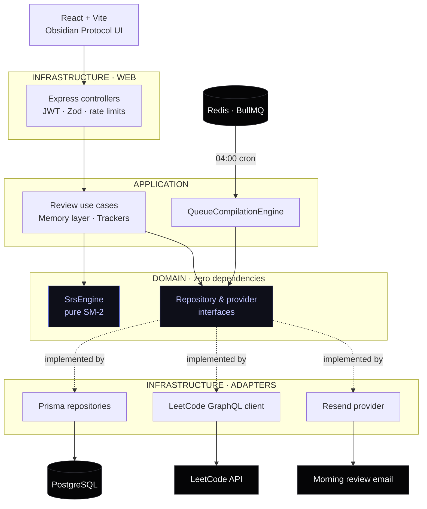

<div align="center">

<h1><code>Y</code>&nbsp;&nbsp;YEAP</h1>

<p><strong>Your Early AM Practice</strong></p>

<p>
  Spaced repetition for LeetCode. Sync your solves, let a tuned SM-2 engine schedule them,<br>
  and wake up to one email that says exactly what to review.
</p>

<p>
  
  
  
  
  
  
</p>

<p><sub><code>ALGORITHM</code>&nbsp; SM-2 · EF floor 1.3 &nbsp;&nbsp;·&nbsp;&nbsp; <code>ARCHITECTURE</code>&nbsp; domain / application / infrastructure &nbsp;&nbsp;·&nbsp;&nbsp; <code>DELIVERY</code>&nbsp; Resend email</sub></p>

</div>

---

## `01` · Why it exists

Flashcards fail for algorithms because they test recall of an answer, not recall of a *pattern*.
YEAP treats every solved problem as a memory with a decay curve: it tracks the easiness factor of
each problem, the mastery of each topic behind it, and the kind of mistake you made (logic flaw,
edge case, syntax slip). Each morning it compiles the five problems you are closest to forgetting
and mails them to you before the day starts.

Everything below that line — the scheduling math, the queue compilation, the email — runs on a
server you control.

---

## `02` · Architecture

Dependencies point inward. The domain layer knows nothing about Prisma, Express, Redis, or Resend.



| Layer | Path | Rule |
| :-- | :-- | :-- |
| Domain | `src/domain/` | Pure math and interfaces. Zero imports from outside the layer. |
| Application | `src/application/` | Orchestrates use cases through injected interfaces. |
| Infrastructure | `src/infrastructure/` | Prisma, Express, BullMQ, GraphQL, Resend — all the I/O. |
| Shared | `src/shared/` | Logger and cross-cutting utilities. |
| Frontend | `frontend/` | React 19 + Vite + Tailwind v4 client. |

---

## `03` · Quick start

**Prerequisites** — Node.js 18+, PostgreSQL. Redis only if you want the daily worker.

```bash
# 1 · install (postinstall runs prisma generate)
npm install

# 2 · configure
cp .env.example .env      # set DATABASE_URL and a 32+ character JWT_SECRET

# 3 · migrate and seed
npm run prisma:migrate
npm run prisma:seed

# 4 · run the API
npm run dev               # http://localhost:3000

# 5 · run the web app (separate terminal)
cd frontend && npm install && npm run dev
```

Add the worker only on a persistent host — it needs Redis:

```bash
ENABLE_WORKER=true npm run dev
```

<details>
<summary><b>Other commands</b></summary>

| Command | What it does |
| :-- | :-- |
| `npm test` | Full Jest suite. `npm run test:watch` for watch mode. |
| `npm test -- --coverage` | Suite with a coverage report. |
| `npm run build` | `prisma generate` then `tsc` into `dist/`. |
| `npm start` | Run the compiled server from `dist/`. |
| `npm run prisma:studio` | Browse the database in Prisma Studio. |
| `npm run problems:sync` | Pull the 100 newest public LeetCode questions into the catalogue. |

</details>

---

## `04` · Configuration

| Variable | Required | Notes |
| :-- | :-- | :-- |
| `DATABASE_URL` | ✅ | PostgreSQL connection string. |
| `DATABASE_CONNECTION_LIMIT` | — | Pool size, appended to `DATABASE_URL` at startup. Use `1` on serverless, ~`10` on a persistent host. A value already in the URL wins. |
| `DATABASE_POOL_TIMEOUT` | — | Seconds a query waits for a free connection before failing. |
| `JWT_SECRET` | ✅ | 32+ random characters. Signs 15-minute access tokens. |
| `AUDIT_IP_SALT` | — | Salt used to hash IPs in audit records. Falls back to `JWT_SECRET`; set it separately in production. |
| `PORT` / `NODE_ENV` | — | Default `3000` / `development`. |
| `ALLOWED_ORIGINS` | — | Comma-separated CORS allow-list. Must include your frontend origin. |
| `FRONTEND_URL` / `BACKEND_URL` | — | Used for OAuth redirects and the email CTA. The CTA is omitted if unset. |
| `GOOGLE_CLIENT_ID` / `_SECRET` | — | Enables Google sign-in. |
| `GITHUB_CLIENT_ID` / `_SECRET` | — | Enables GitHub sign-in. |
| `RESEND_API_KEY` | worker | Required to send mail. `NOTIFICATION_FROM_EMAIL` must be a verified sender. |
| `EMAIL_VERIFICATION_SECRET` | — | Separate HMAC key for email OTPs. Falls back to `JWT_SECRET`. |
| `REDIS_URL` | worker | Required when `ENABLE_WORKER=true`. |
| `ENABLE_WORKER` | — | Default `false`, so the API needs no Redis and no long-running process. |
| `QUEUE_CRON` / `QUEUE_TIMEZONE` | — | Default `0 4 * * *` in `Asia/Kolkata`. |
| `LEETCODE_GRAPHQL_URL` | — | Falls back to `https://leetcode.com/graphql`. |

---

## `05` · API reference

Base URL `/api`. Every route requires `Authorization: Bearer <accessToken>` **except** `/api/auth/*`,
`/api/share/:shareToken*`, and `/health`.

<details open>
<summary><b><code>/api/review</code></b> — the SM-2 loop</summary>

| Method | Route | Purpose |
| :-- | :-- | :-- |
| `POST` | `/submit` | Score a review: `{ problemId, qualityScore: 0-5 }`. Advances or resets the schedule. |
| `POST` | `/report` | Same as submit but by slug: `{ problemSlug, qualityScore }`. No external API calls. |
| `POST` | `/track` | Start tracking a problem: `{ problemId }`. |
| `POST` | `/sync` | Detect today's accepted LeetCode submissions and track the new ones. |
| `GET` | `/due` | Everything due now, plus the tracked total. |
| `GET` | `/history` | All tracked problems. Optional `?limit=` (1–200, capped) and `?offset=` switch on pagination and add `limit`, `offset`, and `hasMore` to the response. |

```jsonc
// POST /api/review/submit  →  200
{
  "success": true,
  "message": "Review submitted. Next review scheduled in 6 day(s).",
  "data": {
    "problemId": "cljx8...",
    "problemTitle": "Two Sum",
    "topicTags": ["Array", "Hash Table"],
    "newInterval": 6,
    "newEasinessFactor": 2.5,
    "nextDueDate": "2026-01-17T04:00:00.000Z",
    "repetitions": 2,
    "qualityScore": 4,
    "wasDue": true
  }
}
```

</details>

<details>
<summary><b><code>/api/auth</code></b> — sessions and account lifecycle</summary>

| Method | Route | Purpose |
| :-- | :-- | :-- |
| `POST` | `/register` · `/login` | `{ email, password }` (register also takes `name`). Returns a 15-minute access token and a rotating 30-day refresh token. |
| `POST` | `/verify-email` · `/resend-verification` | Email OTP verification, rate limited separately. |
| `GET` | `/google` · `/google/callback` | Redirect-based Google OAuth. |
| `GET` | `/github` · `/github/callback` | Redirect-based GitHub OAuth. |
| `POST` | `/refresh` · `/logout` | `{ refreshToken }`. Refresh rotates the token. |
| `PATCH` | `/profile` | Update profile fields. |
| `POST` | `/delete-account/reauth` | Re-authenticate before deletion. CSRF protected. |
| `DELETE` | `/delete-account` | Soft-deletes the account; the daily worker skips it immediately. |

</details>

<details>
<summary><b>Problems, trackers, notes, streak, sharing</b></summary>

| Method | Route | Purpose |
| :-- | :-- | :-- |
| `GET` | `/api/problems/search?q=` | Trigram-indexed title/slug search. |
| `GET` | `/api/problems/:slug` | Single problem plus the caller's note for it. |
| `GET` | `/api/trackers` · `POST` `/api/trackers` | List or create a company interview tracker. |
| `PATCH` | `/api/trackers/:trackerId` | Update a tracker. |
| `GET` | `/api/trackers/:trackerId/readiness` | Readiness score for that tracker. |
| `GET` | `/api/trackers/companies` · `/api/trackers/topics/heatmap` | Supported companies; topic mastery heatmap. |
| `PATCH` | `/api/notes/:problemId` | Save a note. `GET /api/notes/important` lists flagged ones. |
| `GET` | `/api/streak` | Current and longest streak, whether today is safe, and freezes available. |
| `GET` `PATCH` | `/api/share/settings` | Read or update public-share settings. |
| `GET` | `/api/share/:shareToken` · `/page` · `/image.png` | Public share payload, page, and OG image. |
| `GET` | `/health` | Liveness probe. No auth. |

</details>

---

## `06` · The SM-2 engine

You grade recall from 0 to 5. Anything below 3 is a failure and resets the interval to one day;
3 and above advances it and nudges the easiness factor.

| Quality | Meaning | Effect |
| :-: | :-- | :-- |
| `0` | Complete blackout | Reset → 1 day |
| `1` | Incorrect | Reset → 1 day |
| `2` | Incorrect, but recall felt close | Reset → 1 day |
| `3` | Correct, hard | Advance · EF drops |
| `4` | Correct, hesitant | Advance · EF stable |
| `5` | Perfect recall | Advance · EF increases |

Intervals run `1 → 6 → round(previous × EF)`. The easiness factor never falls below **1.3**, and
every computed due date is normalised to **04:00 UTC** so a review is either due for the whole day
or not at all.

Queue priority is not pure EF. Each due item is scored `60%` on how weak its easiness factor is and
`40%` on the mastery of its weakest topic, so a shaky topic surfaces even when its EF looks healthy.
The morning queue is then capped at five items, and flags anything under EF `1.8` as critical.

---

## `07` · Daily worker

The API defaults to `ENABLE_WORKER=false`: no Redis, no long-running process, deployable to Vercel
unchanged. Run the worker separately on Railway, Render, or Fly.io with `ENABLE_WORKER=true`,
`REDIS_URL`, `RESEND_API_KEY`, and a verified `NOTIFICATION_FROM_EMAIL`. It registers an idempotent
BullMQ scheduler at `0 4 * * *` in `Asia/Kolkata`, overridable via `QUEUE_CRON` and `QUEUE_TIMEZONE`.

A GitHub Actions cron can drive the same compilation without Redis by running the ephemeral runner
(`src/infrastructure/workers/runWorkerOnce.ts`), which executes one batch and exits. It needs the
`DATABASE_URL` secret, and `npm run problems:sync` is worth running before it so the catalogue is
current.

One run does a fixed number of queries regardless of user count: load active users, one grouped
tracked-count, one bulk seed per under-tracked user, one ranked due query, one grouped due-count,
one mastery query. Then it mails each user their five.

---

## `08` · Performance and change history

Two documents track the engineering work in this repo, and they are meant to be read together:

- **[`PERFORMANCE.md`](./PERFORMANCE.md)** — every known bottleneck with file and line references,
  why it costs, and the fix, grouped by how hard it is to solve.
- **[`CHANGES.md`](./CHANGES.md)** — the work log. What changed, **why**, files touched, caveats, and
  which findings are still deferred and for what reason.

---

## `09` · Tech stack

| | |
| :-- | :-- |
| **Runtime** | Node.js 18+ · TypeScript 5 (`strict`) |
| **HTTP** | Express 4 · Helmet · CORS · gzip compression |
| **Data** | PostgreSQL via Prisma ORM · `pg_trgm` GIN indexes for search |
| **Queue** | BullMQ 5 + ioredis, optional |
| **Email** | Resend |
| **Frontend** | React 19 · Vite · Tailwind v4 · TanStack Query |
| **Validation** | Zod |
| **Testing** | Jest + ts-jest |

<div align="center">
<br>
<sub><b>YEAP</b> · Your Early AM Practice &nbsp;&nbsp;·&nbsp;&nbsp; SM-2 Algorithm</sub>
</div>
